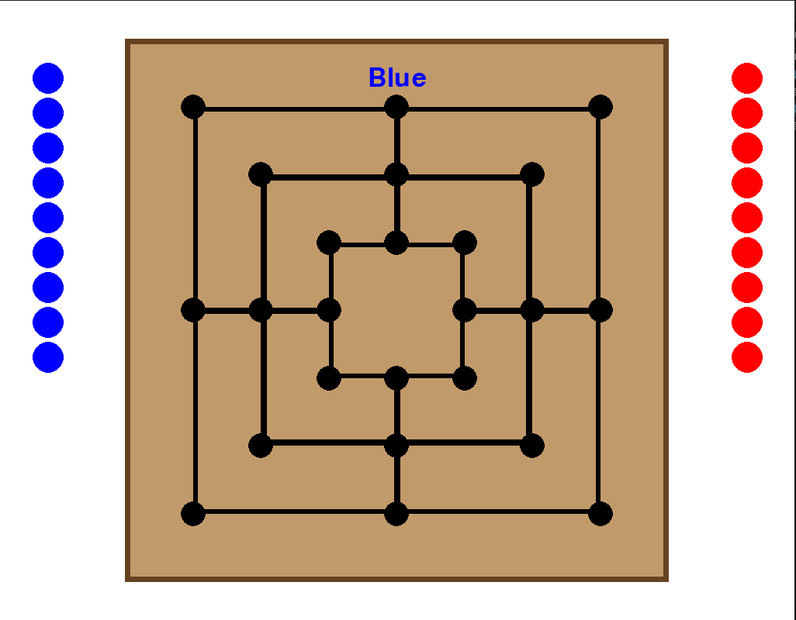

# Nine Men's Morris 

This is a recreation of the board game Nine Men's Morris using pygame. 

This serves as a proof of my python coding abilities. 

## Rules
To begin with, players take turns to play a piece of their own colour on any unoccupied point until all eighteen pieces have been played. After that, play continues alternately but each turn consists of a player moving one piece along a line to an adjacent point.

During both of these phases, whenever a player achieves a mill, that player immediately removes from the board one piece belonging to the opponent that does not form part of a mill. If all the opponents pieces form mills then an exception is made and the player is allowed to remove any piece. It is only upon the formation of a mill that a piece is captured but a player will often break a mill by moving a piece out of it and then, in a subsequent turn, play the piece back again, thus forming a new mill and capturing another piece.

Captured pieces are never replayed onto the board and remain captured for the remainder of the game. The game is finished when a player loses either by being reduced to two pieces or by being unable to move.

## Setup 

Each player has nine pieces. The winner is the first player to align their three pieces on a line drawn on the
board.

## Gameplay

The board is empty to begin the game. Players take turns placing their pieces on empty points,
trying to create a row of three (a mill). If a player creates a mill, they remove 1 of their opponent’s pieces from
the board, except any in a mill. If an opponent only has pieces in a mill, one can be captured. When all pieces
are placed, players take turns moving to an open adjacent point on the board, trying to form a mill. Pieces
cannot jump over other pieces. Each time a mill is formed, an opponent’s piece is removed. Play then passes
back to the other player. Players can “break” and “remake” mills. When one player has three pieces left, they
can “jump” their pieces to any vacant point on the board. Play ends when one player only has two pieces left

## How to Play

To play the game please download the file <em>nineMensMorris.py</em> and run the file locally. 

## Future Steps 
<ul>
  <li>Remove prominent bugs</li>
  <li>Transfer to JavaScript / React</li>
  <li>Improve Game Visuals</li>
  <li>Keep Track of Player Winnings</li>
  <li>Include a method to save stats and game history on a file, stored locally</li>
  <li>Upload to a pygame hosting website suhc as itch.io</li>
</ul>
